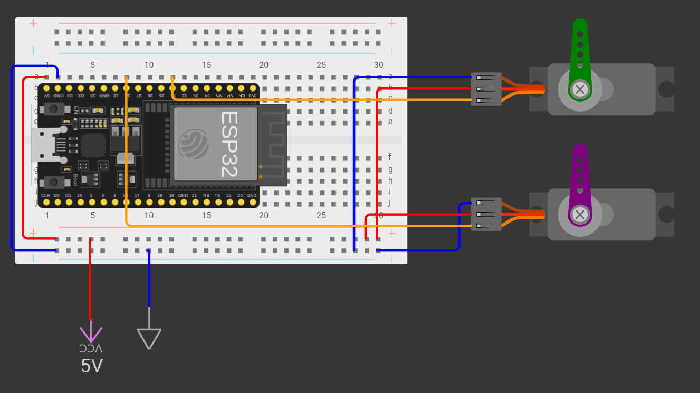

# 1. Goals of this project
In this project, my goal is to track ISS (International Space Station) location, predict when it will be visible from my location and send notification about that time to my phone. 
I also want to build small home station, which will receive data from my server through WiFi and then point to the ISS, so it will be even easier to spot from the earth.

# 2. Features
Current project features (already implemented):
- Get times when ISS will be visible (start time, optimal time and end time) for 24 hours ahead
- Then check for each time two conditions: 
    - Is sun under the horizon (it's altitude is < 0 degrees)
    - ISS is sunlit
- Times, for which are all conditions met, are then sent to my *Telegram* account with usage of their bot.
- Script that waits for a http request and sends back ISS altitude and azimuth in degrees
- ESP32 module script that connects to the WiFi and retrieves data from server. With that data, it than controls two servo motors (one for azimuth and one for altitute)
- **_NOTE:_ Script doesn't take weather into account. If it's cloudy, the ISS may not be visible because it could be behind the clouds.**

# 3. Requirements
Pip packages app uses:
- skyfield
- colorama
- dotenv
- requests
- fastapi
- uvicorn

# 4. Installation
- Clone repo
```bash
git clone https://github.com/strnadaljaz/ISS_tracker.git
```

- Create virtual environment
```bash
sudo apt install python3-venv
python3 -m venv venv
source venv/bin/activate
```

- Install dependencies
```bash
pip install -r requirements.txt
```

# 5. Circuit
On the picture bellow, you can see electric circuit for this project. Components that you will need are: ESP32 chip, 2 servo motors, breadboard, some wires, 5V power supply. 


# 6. Usage
- Run script
```bash
python3 main.py
```
- Calculations for ESP32 module
```bash
uvicorn tracker:app --host 0.0.0.0 --port 8000
```

# 7. Configuration
If you want to run it yourself, you need to create a *.env* file, in which you put six variables:
- LATITUDE (your location latitude)
- LONGITUDE (your location longitude)
- ELEVATION (your elevation) and
- TIMEZONE (your timezone, for example "Europe/Ljubljana")

For Telegram bot purposes you also need to set (how to get them go look at their documentation): 
- BOT_API and
- CHAT_ID

If you want to run tracking with ESP32 chip, you need to create a file *secrets.h* in *Arduino/include/*. Post code below into that file:
```cpp
#pragma once

#define WIFI_SSID <YOUR NETWORK SSID>
#define WIFI_PASS <YOUR NETWORK PASSWORD>
#define HOST <SERVER HOSTNAME (can be ip)>
```

# 8. Credits
Thanks to Skyfield for an amazing library! Without them, this project would be a lot harder.
Also thanks goes to Telegram for their free chat bot.
